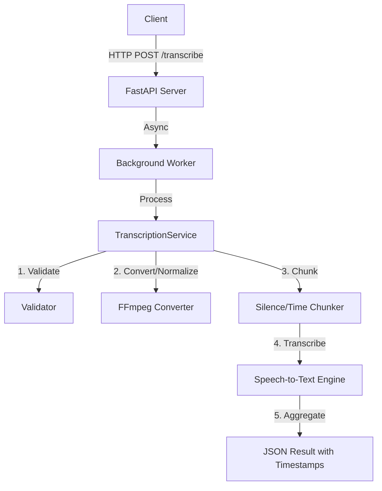

# Developer Guide: Transcription Pipeline

This guide covers the technical architecture, implementation details, and design decisions for the `transcription-pipeline` project.

## 🏗️ Architecture



## 🎯 Design Decisions

### 1. Audio Format Handling

**Decision**: Use `pydub` library with FFmpeg backend.
**Rationale**:

- Provides a consistent interface for format conversion.
- Automatically handles normalization (16kHz, Mono) required for speech recognition.

### 2. Long Audio Files

**Decision**: Intelligent chunking strategy.

- **Primary**: Split on silence (natural pauses).
- **Fallback**: Fixed-time chunking if silence detection fails.
**Rationale**: Standard STT APIs often have time limits. Chunking allows processing arbitrarily long files while maintaining context.

### 3. Asynchronous Processing

**Decision**: FastAPI `BackgroundTasks`.
**Rationale**: Transcription is slow. Async processing prevents blocking the API thread and allows the client to receive immediate confirmation (Job ID) while work happens in the background.

## 📚 API Specification

### POST /transcribe

Submit a new transcription job.

- **Input**: `multipart/form-data` with `file`.
- **Output**: `{"job_id": "uuid", "status": "pending"}`

### GET /jobs/{job_id}

Check status and get results.

- **Output**:

    ```json
    {
      "job_id": "...",
      "status": "completed",
      "result": {
        "transcript": "Full text...",
        "segments": [
          {"start": 0.0, "end": 5.2, "text": "..."}
        ]
      }
    }
    ```

## 🧪 Testing

Run the test suite using `pytest`:

```bash
pytest test_transcription.py
```

This runs integration tests covering file validation, API endpoints, and mock transcription.
