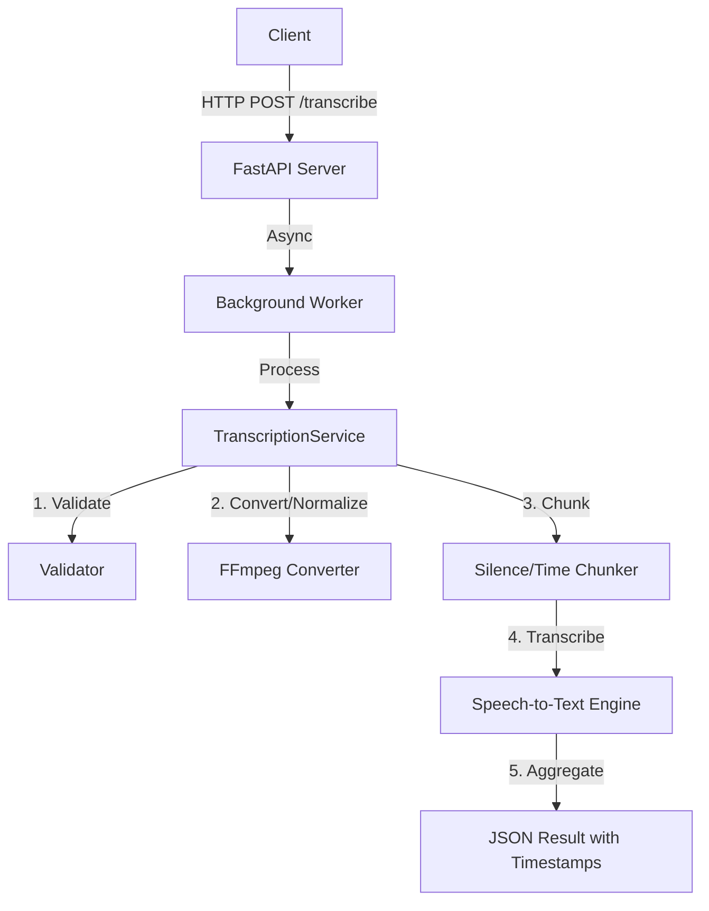

# Developer Guide: Transcription Pipeline

This guide covers the technical architecture, implementation details, and design decisions for the `transcription-pipeline` project.

## 🏗️ Architecture



## 🎯 Deep Dive: Design Decisions & Rationale

### 1. Audio Format Handling

**Problem**: Different formats (MP3, WAV, etc.) require different decoders.
**Solution**: Unified conversion pipeline using FFmpeg (`pydub`).

**Implementation**:

- All inputs are converted to **16kHz Mono WAV** before processing.
- This ensures compatibility with any Speech-to-Text engine (Google, Whisper, etc.).
- **Why?**: Consistency. By normalizing early, the rest of the pipeline only has to handle one format.

### 2. Handling Long Audio Files

**Problem**: API timeouts and memory limits on 60-minute+ files.
**Solution**: Intelligent dual-chunking strategy.

- **Primary Strategy**: **Silence-Based Chunking**. Splits audio at natural pauses (>500ms silence). This preserves sentence context.
- **Fallback Strategy**: **Time-Based Chunking**. If silence detection fails (e.g., continuous music background), it falls back to fixed 60-second chunks.
- **Why?**: Guaranteed processing. The system will never fail just because a file is "too long."

### 3. Asynchronous Processing Architecture

**Problem**: Transcription is slow (approx 1:1 real-time). Keeping a user waiting on an HTTP request will cause a timeout.
**Implementation**:

- **FastAPI BackgroundTasks**: The API returns a `job_id` immediately (Status: Pending).
- The heavy lifting happens in a background worker thread.
- **Production Scaling**: This design easily scales by replacing `BackgroundTasks` with a dedicated queue like **RabbitMQ** or **Redis + Celery**, without changing the client-facing API.

### 4. Timestamp Precision

**Decision**: Calculate timestamps manually from chunk offsets.
**Why?**: Many free Speech-to-Text APIs (like Google's basic tier) return text *without* timestamps. By tracking the duration of each audio chunk, we can reconstruct the timeline (e.g., Chunk 2 starts where Chunk 1 ended) with millisecond precision, regardless of the engine used.

## 📚 API Specification

### POST /transcribe

Submit a new transcription job.

- **Input**: `multipart/form-data` with `file`.
- **Output**: `{"job_id": "uuid", "status": "pending"}`

### GET /jobs/{job_id}

Check status and get results.

- **Output**:

    ```json
    {
      "job_id": "...",
      "status": "completed",
      "result": {
        "transcript": "Full text...",
        "segments": [
          {"start": 0.0, "end": 5.2, "text": "..."}
        ]
      }
    }
    ```

## 🧪 Testing

Run the test suite using `pytest`:

```bash
pytest test_transcription.py
```

This runs integration tests covering file validation, API endpoints, and mock transcription.
